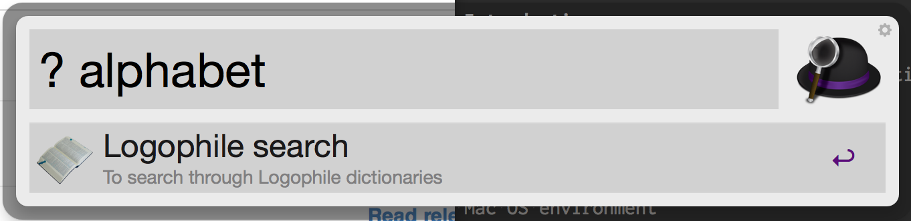

workflow_logophile
==================

An Alfred workflow to perform bulk search via Logophile.

# Introduction

The workflow file allows you to search multiple dictionaries via [Logophile](http://www.dicwizard.jp/logophile/) application.

Please note that the workflow depends upon Ruby 1.8 (OMG) embedded within Mac OS X to use 'require osx/cocoa'. The workflow would not work if legacy Ruby might discontinued or updated. Mac OS X Yosemite does not have Ruby 1.8 with the library so the workflow does not work.

# Requirement

- Mac OS Mavericks or lower
- [Alfred 2](http://www.alfredapp.com/)
- [Alfred PowerPack](https://buy.alfredapp.com/) with payment

# Installation

Just [download](https://github.com/hachi8833/workflow_logophile/blob/master/Logophile.alfredworkflow?raw=true) and open it with Alfred 2.

# Usage

- Just type "? " (with space), words you want to search for, and then press Enter.

# Reference

- [サービスメニューをAppleScriptから利用するAppleScriptハンドラ『doServiceMenu』](http://veadardiary.blog29.fc2.com/blog-entry-2973.html)
- [Mavericksでrequire ‘osx/cocoa’が出来ない](http://rcmdnk.github.io/blog/2013/10/23/computer-mac/)
